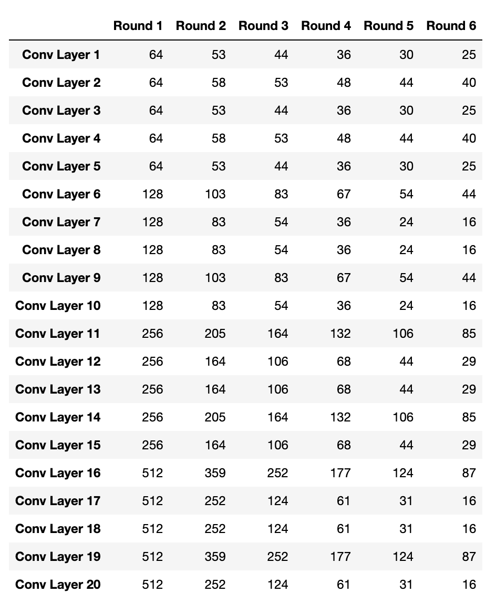

# Model Compression in Deep Vision Networks

## Project Description

 - Current state-of-the-art vision models have millions of parameters which makes them very resource-intensive. Our motivation is to reduce the computational and memory requirements of these models.
 - Our goal is to compress and optimize these Convolutional Neural Network (CNN) models by reducing their size, inference time, and memory consumption, without compromising much on accuracy.
   This would improve the model accessibility and it can be deployed to embedded and edge devices which have limited resources and compute constraints
 - Pruning and Quantization can make the model smaller, faster, simpler, and more efficient, and lead to improved performance. Pruning can make the model simpler by removing unnecessary connections and weights, and Quantization can make the model more efficient by reducing the number of computations.
 - We use pruning and quantization approaches to compress the model. As a result, we observe that model size, inference time, and memory consumption metrics are reduced significantly.
   We compute layer importance in order to perform layer-importance based pruning, and then compare performance at different pruning levels. We also experiment with different quantization techniques and compare metrics with each approach.


## Repo Description

> We worked with ResNet18 and VGG16 Architectures on the CIFAR-10 dataset
```
   .
   ├── VGG16                   # Folder containing all VGG16 and VGG16_BN code and notebooks
   │   ├── Torch_Pruning       # Contains modules for filter pruning in Conv layers
   │   │   └── ...             # Code Referenced from https://github.com/VainF/Torch-Pruning with modifications             
   │   ├── layer_importance    # Contains modules for computing importance of Conv layers
   │   │   └── ...             # Code Referenced from https://github.com/tyui592/Pruning_filters_for_efficient_convnets with modifications              
   │   ├── *.ipynb             # Contains all notebooks for layer importance computation, pruning, fixed-point quantization, and static quantization for VGG16 and VGG16_BN
   ├── ResNet18                # Folder containing all ResNet18 code and notebooks
   │   ├── Torch_Pruning       # Contains modules for filter pruning in Conv layers
   │   │   └── ...             # Code Referenced from https://github.com/VainF/Torch-Pruning with modifications             
   │   ├── quantize_new        # Contains code for training and fixed point quantization of ResNet18 model
   │   │   └── ...             # Code Referenced from https://github.com/aaron-xichen/pytorch-playground with modifications             
   │   ├── *.ipynb             # Contains all notebooks for pruning, fixed-point quantization, static quantization, quantization aware training for ResNet18
   └── assets
       └── image*.png          # Contains all results and table images for README

```

## Commands to Execute

 - All the Jupyter Notebooks are directly executable and contain the required imports to necessary modules.

## Results 

### ResNet 18
- Change in Number of Parameters with rounds of pruning
  - 
- Change in Best Accuracy with incremental rounds of pruning
   - 
- Model Size variation with increasing rounds of pruning
  - 
- The number of out filters in the Conv layers keeps reducing with incremental pruning rounds for the configuration [0.1, 0.1, 0.2, 0.2, 0.2, 0.2, 0.3, 0.3]
  - 
  - 
- MACs/FLOPs trend with pruning
  - 
- Comparison of Model Size, Accuracy and Inference Time in Post Training Static Quantization from FP32 to INT8 in PyTorch
  - 
- Quantization Aware Training
  - 
- Fixed Point Quantization
  - 
- Sparse Pruning + Quantization of ResNet 18 using Tensorflow
  - 


### VGG16
#### Pruning
- Top-1 Accuracy Drop by Pruning upto 90% Filters Iteratively in each Conv Layer
    -  

- Top-5 Accuracy Drop by Pruning upto 90% Filters Iteratively in each Conv Layer
    -  

- Number of Parameters in Model after Pruning Iteratively
    -  

- Model Size after Pruning Iteratively
    -  

- Best and Mean Test Accuracy after Pruning Iteratively
    -  

- MACs of Model after Pruning Iteratively
    -  

- Drop in Number of Filters in Conv Layers after Pruning Iteratively
    -  
- Model Architecture after Pruning Iteratively
    - 

### VGG16_BN
#### Pruning
- Top-1 Accuracy Drop by Pruning upto 90% Filters Iteratively in each Conv Layer
    -  

- Top-5 Accuracy Drop by Pruning upto 90% Filters Iteratively in each Conv Layer
    -  

- Number of Parameters in Model after Pruning Iteratively
    -  

- Model Size after Pruning Iteratively
    -  

- Best and Mean Test Accuracy after Pruning Iteratively
    -  

- MACs of Model after Pruning Iteratively
    - 

- Drop in Number of Filters in Conv Layers after Pruning Iteratively
    - 

- Model Architecture after Pruning Iteratively
    - 

#### VGG16 Quantization
- Top-1 and Top-5 Accuracy with 32-bit to 8-bit Precision
    -  

- Metrics with Different Types of Quantization
    -  

- Model Size with Different Types of Quantization
    -  

- Top-1 and Top-5 Accuracy with Different Types of Quantization
    - 

- Inference Time with Different Types of Quantization
    -  

## Observations

 - We experimented with layer importance-based filter pruning  in order to prune more filters from less important layers and maintain accuracy even after five rounds of pruning
 - Similar to Huang et al [2018] we see that the filters in the deeper layers learn redundant information and deeper layers can be pruned upto 60%  without losing much accuracy
 - Through our experiments we found that L1 Strategy pruning is more effective than Random Strategy pruning as it considers the absolute magnitude of filter weights
 - We quantized the model to use 8-bit integers (INT8) instead of 32-bit floats (FP32), and compared performance across different quantization configurations
 - With quantization, we achieved 4x reduction in model size and number of parameters for VGG16 and ResNet18
 - With pruning on VGG16, we achieved almost a 50x reduction in number of parameters and model size, and 7.5x reduction in FLOPs with only 1% drop in best top-1 accuracy and increased mean top-1 accuracy
 - With pruning on ResNet 18, we achieved almost a 52x reduction in number of parameters and model size, and 19x reduction in FLOPs with only 1% drop in mean top-1 accuracy
 - Number of Parameters consistently decrease exponentially with increasing rounds of pruning which is expected
 - Drop in Best Accuracy is minimal with the configuration of low percentage pruning of initial layers and higher percentage pruning of deeper layers and Scaling up percentage of pruning of layers result in drastic drop of accuracy across the rounds
 - Model Size consistently decrease exponentially with increasing rounds of pruning which is expected as the Number of Params decrease
 - The behavior of MACs/FLOPs is similar to the trend seen in model size and parameters

## References:
 - https://github.com/VainF/Torch-Pruning
 - https://www.tensorflow.org/model_optimization/guide/pruning/pruning_with_keras
 - https://github.com/Forggtensky/Quantize_Pytorch_Vgg16AndMobileNet
 - https://github.com/aaron-xichen/pytorch-playground
 - https://github.com/leimao/PyTorch-Static-Quantization
 - https://github.com/tyui592/Pruning_filters_for_efficient_convnets


